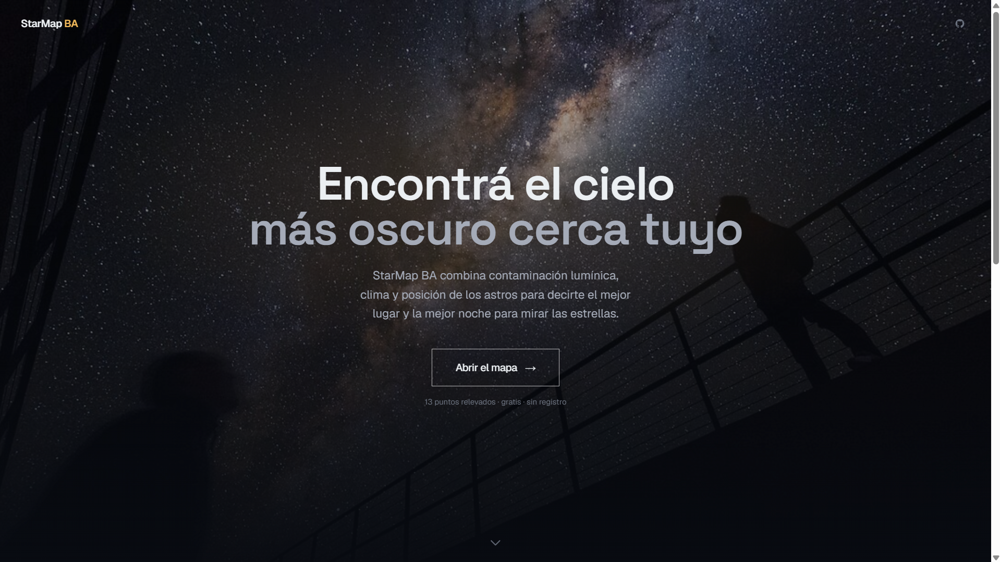
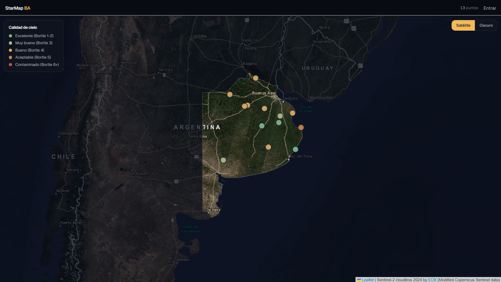
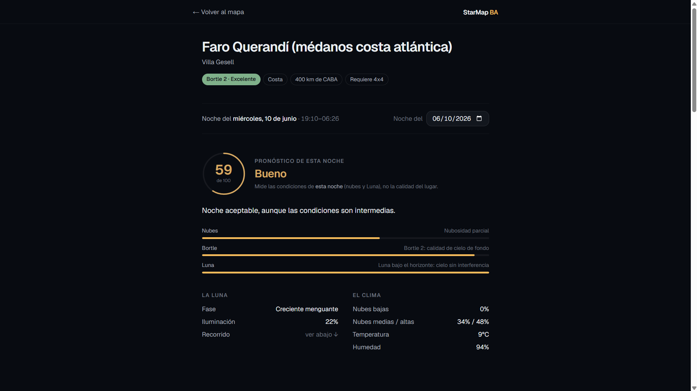

<div align="center">

# 🌌 StarMap BA

**Find the darkest sky near you.**

A web app I built to help amateur astronomers in Buenos Aires Province, Argentina decide *where* and *when* to go stargazing — combining satellite light-pollution data, weather forecasts, and real-time astronomical math into a single 0–100 observation score.

[](https://starmapba.com.ar)
&nbsp;


[](https://github.com/jota1221-coder/starmap-ba/actions/workflows/ci.yml)




</div>

> The product UI is in Spanish — its users are Argentine stargazers. I wrote this README in English.

## Why I built it

I'm studying data science, and I've always been into astronomy. The catch is that from the city you basically can't see the sky: light pollution erases almost everything. Every time I wanted to go out and actually see stars, I ran into the same two questions — and no single map answered both:

- **Where** can I go? A genuinely dark spot, real, reachable by car.
- **When** is it worth it? A clear night, without a bright moon.

StarMap BA is my answer to that intersection. I built it to solve my own problem, and turned it into a project where I could take data the whole way — from a raw source to something people can actually use.

## What it does

It maps **22 real, car-accessible observation spots** across Buenos Aires Province, ranks them by how dark their sky actually is — *measured* from satellite data, not guessed — and for any given night gives a **0–100 score** (cloud cover + moon + sky darkness) along with what you'll be able to see and where to point.





## The part I'm proudest of: turning a hunch into a measurement

I started by rating each spot's darkness by hand, on a coarse grid. That bothered me — it was basically an opinion. So I validated it against an independent source: I processed **NASA/NOAA VIIRS** satellite light-pollution data for the whole province and compared it to my own ratings. They held up, with a **Spearman correlation of +0.76**. Interestingly, the *exact pixel* correlates weakly (+0.32) but the surrounding ~3 km correlates strongly — which is exactly the point, because you drive to the dark cell, you don't stand on a single coordinate.

I also used the 2012–2024 imagery to project how light pollution is likely to grow **toward 2035**. The whole analysis is reproducible (the Jupyter notebooks are in this repo) and written up on the live [Data Science page](https://starmapba.com.ar/data-science).

## How the observation score works

The core is a deliberately simple, transparent model — three independent factors, each from 0 to 1, multiplied together:

```
score = 100 × cloudFactor × bortleFactor × moonFactor
```

It's multiplicative on purpose: if it's fully overcast, it doesn't matter how dark the site is — the score collapses to zero, exactly like reality. Low clouds weigh far more than high cirrus, and the moon only counts when it's actually above the horizon. I kept it explainable because I'd rather defend a simple model I understand than ship a black box. The astronomical values — moon phase and altitude, planet positions — are computed locally, so there's no external dependency and the result is deterministic.

## A few engineering decisions

- **Each route is rendered to match its data:** a static landing page, the map on ISR, and dynamic per-spot pages so conditions are always fresh — all server-rendered for SEO.
- **Serverless Postgres (Neon) through Prisma,** with separate dev and prod database branches, so it handles bursts of traffic without me babysitting connections.
- **The basemap was a real choice:** the default imagery had blank tiles over rural Buenos Aires, so I switched to Sentinel-2 cloudless, clipped to the actual province silhouette from IGN.
- **Hardened for a public launch:** rate limiting, link-detection moderation on reviews, HTTP security headers, and fail-fast environment validation.

There's a deeper write-up in [ARCHITECTURE.md](ARCHITECTURE.md), and the visual rationale in [DESIGN.md](DESIGN.md).

## Tech stack

| Layer | Tools |
|---|---|
| Framework | Next.js 16 (App Router, Turbopack), React 19, TypeScript |
| Styling | Tailwind CSS v4 (OKLCH palette), Framer Motion, Space Grotesk + Geist |
| Data | Prisma 7, Neon (serverless Postgres) |
| Auth | Auth.js v5 (magic link), Resend |
| Maps | Leaflet, Sentinel-2 cloudless (EOX), IGN province silhouette |
| Astronomy / weather | astronomy-engine, Open-Meteo, NASA VIIRS (light pollution) |
| Data science | Python, rasterio, geopandas, NumPy, pandas, Matplotlib |
| Infra | Vercel, Upstash (rate limiting) |

## Where I'd like to take it

A few directions I'm interested in exploring next: opening it up to spots submitted by the community, "good night" alerts that email you when a saved place is going to have great conditions, and an offline mode — because it's meant to be used in the field, where there's usually no signal.

## About

I'm **Joaquín Rao**, a data analyst in the making, building data-driven products. It's all open source (MIT) — the app, the data notebooks, and the scoring logic are here to dig into.

[GitHub](https://github.com/jota1221-coder) · [Live demo](https://starmapba.com.ar)

## License

[MIT](LICENSE) © Joaquín Rao

## Credits & data sources

Weather: [Open-Meteo](https://open-meteo.com) · Light pollution: NASA/NOAA VIIRS · Astronomy: [astronomy-engine](https://github.com/cosinekitty/astronomy) · Basemap: [Sentinel-2 cloudless](https://s2maps.eu) by EOX (modified Copernicus Sentinel data) · Province silhouette: IGN Argentina · Hero photo: [ESO / L. Calçada](https://commons.wikimedia.org/wiki/File:Beneath_the_Milky_Way.jpg) (CC BY 4.0)
